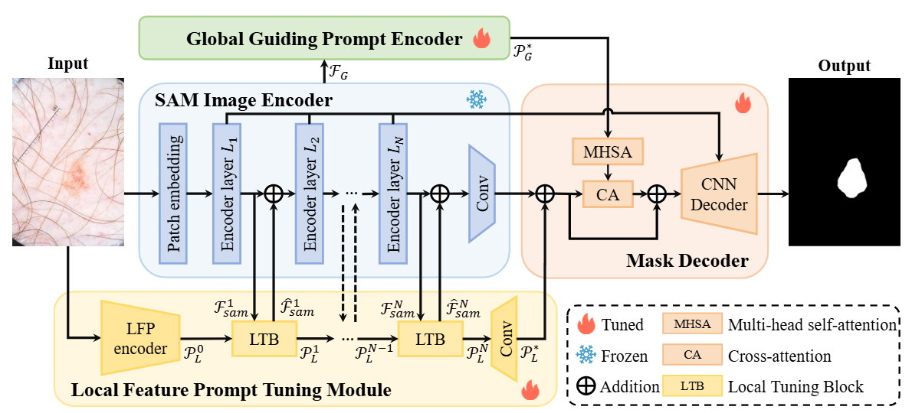

# [CMIG'25] DVPT

<div align=center>

</div>

Official implementation of paper "Taming Large Vision Model for Medical Image Segmentation via Dual Visual Prompting".
[Ruize Cui](https://scholar.google.com/citations?hl=zh-CN&user=rAcxfuUAAAAJ), [Lanqing Liu](https://scholar.google.com/citations?user=36Is6IwAAAAJ&hl=zh-CN), Jing Zou, [Xiaowei Hu](https://scholar.google.com/citations?user=tUb4J0kAAAAJ&hl=en), [Jialun Pei](https://scholar.google.com/citations?user=1lPivLsAAAAJ&hl=en), and [Jing Qin](https://harry-qinjing.github.io/)

👀 [[Paper]](https://www.sciencedirect.com/science/article/abs/pii/S089561112500117X)

**Contact:** ruize.cui@connect.polyu.hk, peijialun@gmail.com


## Environment preparation
The code is tested on python 3.9.16, pytorch 2.1.0, and CUDA 12.1, change the versions below to your desired ones.
1. Clone repository:
```shell
git clone https://github.com/cuiruize/DVPT.git

cd DVPT
```
   
2. Set up anaconda environment:
```shell
# Create DVPT anaconda environment from YAML.file
conda env create -f DVPT.yaml
# Activate environment
conda activate DVPT
```

3. Set up related module
```shell
cd DVPT/segment anything/ops

python setup.py build install
```

## Dataset preparation

Here we provide the processing step for dataset ISIC2017.

### Download ISIC2017 Dataset
- ISIC2017 dataset: https://challenge.isic-archive.com/data/#2017
### Hair elimination
Please utilize the inpaint.py for hair elimination.
### Register datasets
Change the path of the datasets as:
```shell
DATASET_ROOT = 'DVPT/ISIC2017/'
TRAIN_PATH = os.path.join(DATASET_ROOT, 'train/')
TEST_PATH = os.path.join(DATASET_ROOT, 'test/')
VAL_PATH = os.path.join(DATASET_ROOT, 'val/')
```

## Train

```shell
python train.py --dataset {PATH_TO_DATASET} --batch_size 4 --learning_rate 1e-3 --epoch 500
```

Please replace {PATH_TO_DATASET} to your own dataset dir

## 📚 Citation

If this work helps you, please cite this work:

```bibtex
@article{cui2025taming,
  title={Taming large vision model for medical image segmentation via Dual Visual Prompt Tuning},
  author={Cui, Ruize and Liu, Lanqing and Zou, Jing and Hu, Xiaowei and Pei, Jialun and Qin, Jing},
  journal={Computerized Medical Imaging and Graphics},
  pages={102608},
  year={2025},
  publisher={Elsevier}
}
```

## Acknowledgement
This work is based on:

- [Segment Anything Model](https://github.com/facebookresearch/segment-anything)

Thanks them for their great work!
